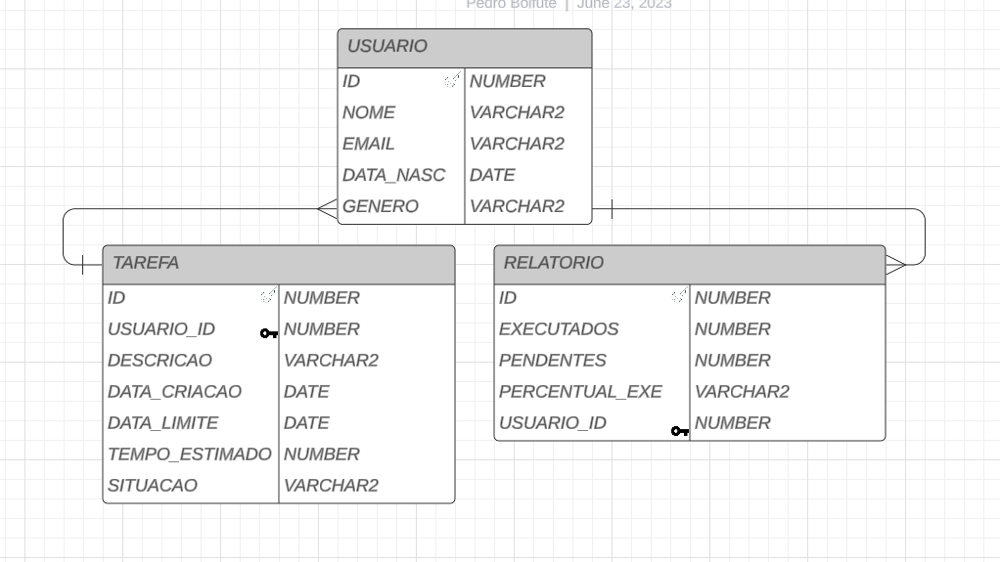

# sql-Oracle

Tabela sql da [oracle](https://apex.oracle.com/pt-br/) para guardar dados de um sistema de [todoList](https://github.com/Pedrobolfute/PomOnFoot).
Mas antes, se atente às observações. Principalmente a 10.

## OBSERVAÇÕES

Execultar na ordem procedural, uma etapa de cada vez.

1. CRIAR TABELA USUARIO;
2. CRIAR TABELA TAREFA;
3. CRIAR TABELA RELATÓRIO;

4. CRIAR SEQUENCE USUARIO_SEQ;
5. CRIAR TRIGGER USUARIO_TRIGGER;

6. CRIAR SEQUENCE TAREFA_SEQ;
7. CRIAR TRIGGER TAREFA_TRIGGER;

8. CRIAR PROCEDURE INSERIR_RELATORIO
9. RODAR RECURSO ORACLE QUE ATUALIZA PROCEDURE DIARIAMENTE

10. **INSERIR NA TABELA USUARIO O PRIMEIRO USUARIO COMO SENDO ANONIMO**

11. **INSERIR NA TABELA TAREFA, RESPEITANTO A ESTRUTURA DO SELECT**

## MODELO RELACIONAL

